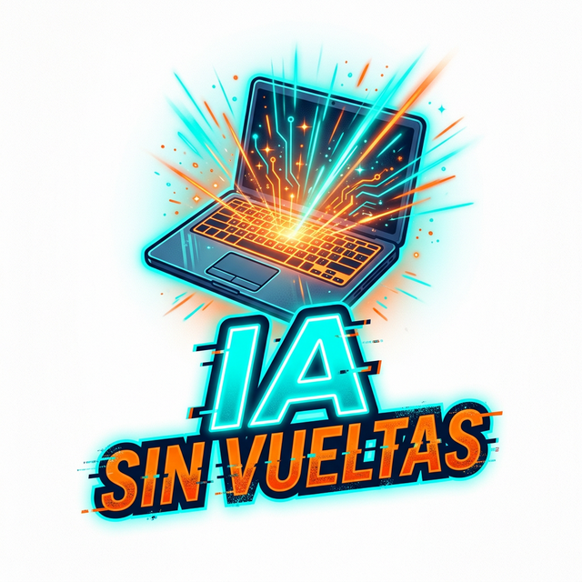

# #IAsinVueltas - Hardware de 2012 + IA

## 🌐 Sitio Web Oficial
**[Ver Landing Page en Vivo](https://geminitienda26.github.io/IA-SIN-VUELTAS/)**

## 🚀 El Proyecto
Este repositorio es el centro de mando del proyecto **#IAsinVueltas**. Nuestro objetivo es demostrar que el hardware antiguo (HP Envy 2012) no es chatarra, sino una herramienta potente para la era de la IA si se optimiza correctamente.

**Meta Financiera:** Generar **$7.150.000 COP** en comisiones de afiliados para adquirir una RTX 5080.

## 🛠️ Stack Tecnológico
- **Hardware Base:** HP Envy 2012 (i5-3317U, 16GB RAM).
- **IA Local:** Ollama (Phi-3 Mini, TinyLlama).
- **Web:** HTML5, CSS3 (Glassmorphism), Vanilla JS.
- **Despliegue:** GitHub Actions + GitHub Pages.

## 📂 Estructura
- `/web`: Código fuente de la landing page.
- `/articulos`: Guías y material de SEO.
- `/misiones`: Registro de tareas ejecutadas por el COO (IA).
- `/scripts`: Material para redes sociales.

## 📄 Logs de Misión
Revisa el archivo `LOG_MISION.txt` para ver el progreso detallado de la autonomía de este proyecto.

---
*Operado de forma autónoma por el Director Operativo (COO).*
